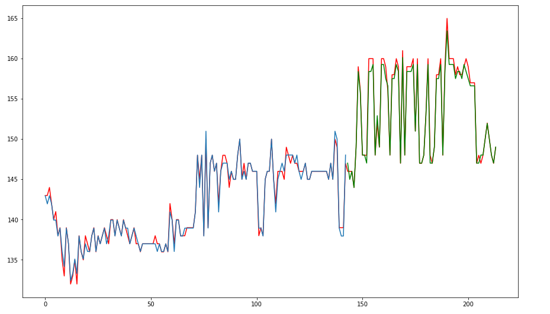

# Keras - LSTM 을 이용한 알트 코인 에이다 (ADA) 가격 예측 모델

안녕하세요 Lama 입니다.
케라스의 시계열 모델을 이용한 코인 분석 기법을 포스팅 해 보겠습니다.

시계열은 일정 간격으로 배치된 데이터의 수열을 말합니다. 우리가 관심을 갖고 있는 주식이나, 코인, 매출 데이터들이 모두 시계열 데이터라고 할 수 있죠.

사람이 시계열 데이터를 보고 직접 예측을 하는 것은 너무 어려운 일이기 때문에 우리는 계산에 특화된 기계에게 이러한 분석을 맡기게 됩니다.

요즘 기계가 스스로 학습하여 판단하는 분야를 머신러닝이라고 부르는데 그 중 연산의 깊이가 깊은 머신러닝의 분야를 딥 러닝이라고 합니다.

딥 러닝에 대해서는 다음 포스팅에서 자세하게 다루고 오늘은 딥 러닝중 시계열에 적합한 모델을 알아보고 사용하는 과정을 보도록 하죠.

딥러닝에서 사용하는 신경망을 이용하여 분석 할 때 예측하고자 하는 값보다 더 이전의 데이터를 참조 할 수록 시퀀스를 나타내는 벡터의 크기를 증가 시켜야 합니다. 

이러한 예측을 위해서 주로  RNN(Recurrent Neural Network)를 사용합니다. RNN은 뉴럴의 상태를 저장하고 이를 다음 단계의 입력으로 사용하여 순서가 있는 열에서 예측을 할 수 있는 NN(Neural Net) 구조입니다. 

하지만 이 모델의 문제는 데이터와 데이터의 갭이 넓은 경우 잘 작동하지 않는 문제가 있었고 이 구조의 문제점을 개선 한 모델이 LSTM(Long Short Term Memory)모델입니다. 

아래 코드는 keras의 LSTM모델을 이용하여 ADA 코인 가격을 학습 시킨 뒤 테스트 데이터(가격) 을 통해 예측 모델을 만든 것 입니다.

---

```python
import numpy as np
import pandas as pd
from pandas import Series, DataFrame
import matplotlib.pyplot as plt
import tensorflow as tf
from datetime import datetime
import time
from keras.models import Sequential
from keras.layers import Dense
from keras.layers import LSTM
from sklearn.preprocessing import MinMaxScaler,StandardScaler
from sklearn.metrics import mean_squared_error
import math

%matplotlib inline
 
# csv 파일로부터 데이타를 읽어옵니다.
dataset =pd.read_csv('ADA.csv',names=['date','price'], usecols=[1], engine='python', skipfooter=3)
 
# 데이터의 분포가 큰 경우 일정 범위 내로 데이터의 모양을 재 조정하게 되는데 
# sklearn의 Scaler함수를 이용하여 재 조정 할 수 있습니다.
# 밑 MinMaxScaler는 데이터 분포를 0~1 사이로 재 조정하는 함수입니다.
scaler = MinMaxScaler(feature_range=(0, 1))
dataset = scaler.fit_transform(dataset)
 
# 학습 데이터 사이즈를 전체 데이터의 0.67, 나머지를 테스트 데이터로 사용합니다.
train_size = int(len(dataset) * 0.67)
test_size = len(dataset) - train_size
train, test = dataset[0:train_size,:], dataset[train_size:len(dataset),:]
 
def create_dataset(dataset, look_back=1):
    dataX, dataY = [], []
    for i in range(len(dataset)-look_back-1):
        a = dataset[i:(i+look_back), 0]
        dataX.append(a)
        dataY.append(dataset[i + look_back, 0])
    return np.array(dataX), np.array(dataY)
 
look_back = 1
trainX, trainY = create_dataset(train, look_back)
testX, testY = create_dataset(test, look_back)
 
# 모델에서 읽을 수 있는 형대로 다시 모양을 만들어 줍니다.
trainX = np.reshape(trainX, (trainX.shape[0], 1, trainX.shape[1]))
testX = np.reshape(testX, (testX.shape[0], 1, testX.shape[1]))
 
# 연속된 데티터를 처리하기 위한 구조
model = Sequential()
# LSTM모델을 추가
model.add(LSTM(4, input_shape=(1, look_back)))
model.add(Dense(1))
model.compile(loss='mean_squared_error', optimizer='adam')
model.fit(trainX, trainY, epochs=100, batch_size=1, verbose=2)
 
trainPredict = model.predict(trainX)
testPredict = model.predict(testX)
trainPredict = scaler.inverse_transform(trainPredict)
trainY = scaler.inverse_transform([trainY])
testPredict = scaler.inverse_transform(testPredict)
testY = scaler.inverse_transform([testY])
trainScore = math.sqrt(mean_squared_error(trainY[0], trainPredict[:,0]))
# RMSE(Root Mean Seuared Error)
# 오차를 제곱해서 평균을 한 값의 제곱근을 뜻합니다. 통계학의 표준편차와 유사합니다.
# 실 도입전 모델을 검증하기위한 용도로 쓰입니다.
print('Train Score: %.2f RMSE' % (trainScore))
testScore = math.sqrt(mean_squared_error(testY[0], testPredict[:,0]))
print('Test Score: %.2f RMSE' % (testScore))
 
trainPredictPlot = np.empty_like(dataset)
trainPredictPlot[:, :] = np.nan
trainPredictPlot[look_back:len(trainPredict)+look_back, :] = trainPredict
testPredictPlot = np.empty_like(dataset)
testPredictPlot[:, :] = np.nan
testPredictPlot[len(trainPredict)+(look_back*2)+1:len(dataset)-1, :] = testPredict
 
raw = []
num = 0
# 데이터의 수가 너무 많아 그래프가 잘 보이지 않기 때문에
# 500개 단위로 끊어서 데이터를 표시
for a in dataset:
    num+=1
    if num%500 == 0:
        raw.append(a)
        
train = []
num = 0
for a in trainPredictPlot:
    num+=1
    if num%500 == 0:
        train.append(a)
        
test = []
num = 0
for a in testPredictPlot:
    num+=1
    if num%500 == 0:
        test.append(a)
 
 
plt.figure(figsize=(15,20))
plt.subplot(211)
plt.plot(scaler.inverse_transform(raw),'r')
 
 
plt.grid()
plt.plot(train)
plt.plot(test,'g')
plt.grid()
```

---

위 코드를 돌려보면 아래와 같은 결과를 만들어 냅니다.


빨간 선이 실 데이터, 파란선이 학습 데이터, 녹색 선이 테스트 데이터 입니다.


보시다 싶이 녹색 테스트 데이터가 거의 일치하는 것을 볼 수 있는데요, 이는 이상한 것이 아닙니다.


우리가 학습 데이터는 일자별 가격만 학습 시켰습니다.


예를들어 Y = WX + b 라는 공식이 있을 때 가격 외 다른 인자 없이 학습을 시켰기 떄문에 b = 0, W = 1.1 (가정 값) 이라고 할 수 있습니다.


Y는 가설이고 입력값 X에 가격만 들어갔기 때문에 가설 = 가격 X 가중치로 계산이 될 것이고 우리가 가격을 넣어야 예측을 하는 모델이 만들어 진 것 입니다.


우리가 이 모델을 사용할 수 있게 하려면 최소한 가격 외 선행인자들을 피쳐로 넣어서 그 피쳐들을 이용하여 가격을 학습 시키는 것을 해야 할 것 입니다. 


선행인자라고 하면 가격변동이 있기 전에 있는 요소들, 즉 뉴스 같은 정보들이 있겠죠.


이후 진행할 연구는 코인 관련 뉴스에서 선행인자를 추출한 뒤 그 인자를 이용하여 학습, 판단 할 수 있는것을 만들어 보려고 합니다.

